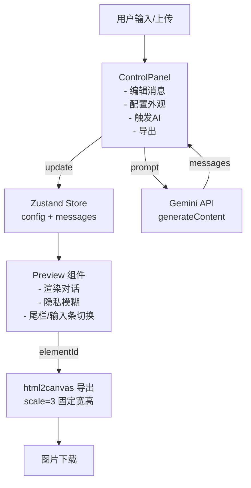

# WeChat 对话生成器 PRD（MVP 版）

## 核心目标 (Mission)
让学生/创作者快速生成「以假乱真、有趣、可截图」的微信对话长图，用最少操作完成编辑与导出，AI 仅做轻量辅助。

## 用户画像 (Persona)
- **主力：学生** —— 想要整蛊、请假、求助、表白或在社交媒体展示“聊天截图”内容，需求是有趣且看起来真实。
- **次要：运营/创作者** —— 需要快速制作可信的聊天素材用于私域或内容演示，不追求完备的企业级流程。
痛点：手工排版耗时、真实感不足、缺少“万能模板”，且希望一键导出高清长图。

## V1: 最小可行产品 (MVP)
- 手动编辑对话：新增/删除/排序消息；支持文本、图片、链接卡片、系统时间。
- 角色与外观：切换我/对方，状态栏时间/信号/电量、聊天标题；头像可换；隐私模糊开关（头像+标题）。
- AI 剧本生成：基于场景生成 N 轮文本消息并写入列表（语气友好、中文全角标点）。
- 营销/挂件栏：可选底部尾栏（文案+二维码），默认关闭。
- 导出：一键高清长图导出（移动端也可），无水印。

## V2 及以后版本 (Future Releases)
- 模板库：行业/语气/节日模板，一键套用。
- 文案助手：敏感词提示/替换，表情/梗推荐。
- 多皮肤：iOS/Android 皮肤、暗色/老人模式、多尺寸拼接。
- 草稿/分享：多项目保存、重命名、分享链接。
- 批量生成：一次生成多套方案，便于择优。
- 品牌中心：水印、品牌色/Logo 预设（可关闭）。

## 关键业务规则 (MVP)
- 消息类型限定：`text | image | link_card | system_time`；system_time 不显示头像和箭头气泡。
- AI 输出仅为 `text`，角色为 `me/other`；不自动生成时间气泡。
- 隐私模式：仅模糊头像与标题，内容保持清晰。
- 导出：固定画布 375x812，scale=3，保持高清与一致布局。
- 尾栏：默认关闭，开启时展示二维码与文案；关闭时显示微信输入条样式。
- 无登录/存储：用户刷新即重置；唯一留存方式为导出下载。

## 数据契约 (MVP)
- GlobalConfig
  - `time: string`
  - `battery: number`
  - `signal: 'wifi' | '5g' | '4g'`
  - `chatTitle: string`
  - `isPrivacyMode: boolean`
  - `showFooter: boolean`
  - `footerQrCodeUrl: string`
  - `footerText: string`
  - `myAvatar: string`
  - `otherAvatar: string`
- MessageItem
  - `id: string`
  - `role: 'me' | 'other'`
  - `type: 'text' | 'image' | 'link_card' | 'system_time'`
  - `content: string` (文本/时间/图片 base64)
  - `linkData?: { title: string; desc: string; thumbUrl: string }`

## 当前进度与问题记录
- 已实现：当前 UI（双栏编辑+实时预览）、消息类型、隐私模糊、尾栏、AI 文本生成、高清导出（html2canvas）。
- 已复现问题 1（导出 0KB）：在移动端“编辑”页触发导出时，预览容器被 `display: none` 导致 html2canvas 生成 0x0 画布。**修复**：导出前检测尺寸，必要时强制展开并设定宽高（375x812 回退），导出后还原；对 0 尺寸抛错提示。已修复于 `utils/imageUtils.ts`。
- 已复现问题 2（导出图片空白/像素缺失）：外链图片（默认头像/二维码或用户链接）因 CORS 被阻塞，导致画布空白。**修复**：导出前抓取 `` 并转为 dataURL（失败时保留原图并告警）；默认头像/二维码改为内联 SVG，避免跨域。已修复于 `utils/imageUtils.ts`、`store.ts`。
- 已复现问题 3（部署空白）：生产打包仅生成空 HTML，原因是 `index.html` 未引用入口脚本，导致无 JS 产物。**修复**：在 `index.html` 底部添加 `<script type="module" src="/index.tsx"></script>`，现已可正常打包，`dist/assets/index-*.js` 生成正常。
- 已复现问题 4（AI 不可用）：原实现依赖 Gemini SDK，未连到目标 AI 端口。**修复**：重写 `services/geminiService.ts` 改为调用 `VITE_AI_BASE_URL/chat/completions`（默认 `https://www.qiangtu.com/v1`），使用 `VITE_AI_API_KEY`/`API_KEY`，返回 JSON 对话数组；保持原 UI 行为。
- 已复现问题 5（导出缩放/不 1:1）：原实现受当前布局、隐藏状态、flex 宽度影响，导出时尺寸被压缩。**修复**：导出时克隆预览节点到视口外，锁定当前宽高（clientWidth/scrollHeight），按设备像素比渲染，避免布局压缩；保持图片内联处理。已修复于 `utils/imageUtils.ts`。
- 环境：本地 dev 服务器已开启 `npm run dev -- --host --port 3001`（日志 `/tmp/wechat-mock-dev-3001.log`，PID 75179）和端口 3000（日志 `/tmp/wechat-mock-dev-3000.log`，PID 75268）。如需重启，先 `kill <pid>` 再运行同命令。

## 架构设计蓝图

### 核心流程 (Mermaid)


### 组件交互说明
- `store.ts`：集中状态（config/messages）及操作（增删改查、排序、隐私切换）。
- `ControlPanel.tsx`：编辑入口，调用 `store` 更新；上传图片走 `utils/fileToBase64`；AI 调 `services/geminiService`；导出调用 `utils/exportImage`。
- `Preview.tsx`：只读消费 `store`，按微信样式渲染；尊重隐私模式与尾栏状态。
- `utils/imageUtils.ts`：文件转 base64；`html2canvas` 导出，固定画布防止布局折叠。
- `services/geminiService.ts`：包装 AI HTTP API（`VITE_AI_BASE_URL/chat/completions`，默认 https://www.qiangtu.com/v1；需 `VITE_AI_API_KEY`），输出文本消息数组。
- 兼容性：当前代码已满足 MVP 范围，无需新增后端或持久化。

### 技术选型与风险
- React + Zustand + Tailwind（CDN）：轻量、无构建依赖于 CDN，但需保持 importmap 版本兼容。
- html2canvas：对跨域图片依赖 `useCORS`；现已在导出前尝试把 `` 转为 dataURL，但若目标站点拒绝跨域仍可能失败，需提示用户改用本地上传。
- AI HTTP 调用：依赖 `VITE_AI_BASE_URL`/`VITE_AI_API_KEY`；返回必须是 JSON 数组，已做 code fence 剥离与 JSON 校验；若网关返回异常会在 UI 露出错误。
- 移动端：双栏切换已实现；需关注长列表滚动性能（当前适量渲染可接受）。

## MVP 原型设计（ASCII 概念稿）

### 方案 A｜极简白底，高对比操作区
```
┌─────────────────────────────┐
│ 顶栏: 标题  导出按钮         │
├──────┬──────────────────────┤
│侧栏  │ 对话列表卡片          │
│选项卡│ - 角色/类型选择       │
│(剧本/│ - 文本/图片/卡片编辑  │
│设置) │ - 排序/删除           │
│      │ - AI 输入+生成按钮    │
├──────┼──────────────────────┤
│ 状态 │ 右侧手机预览 375x812  │
│/头像 │ - 顶部状态栏/标题     │
│/尾栏 │ - 气泡/图片/卡片      │
│开关区│ - 底部输入条/尾栏     │
└──────┴──────────────────────┘
```

### 方案 B｜分栏玻璃态，突出手机预览
```
┌─────────────────────────────┐
│ 半透明顶部: Logo + 导出      │
├───────────┬─────────────────┤
│ 左侧窄栏  │ 右侧大手机预览   │
│ - AI 卡片 │ - 居中放大手机   │
│ - 消息列表│ - 阴影/渐变背景  │
│   折叠组  │ - 悬浮“返回编辑” │
│ - 设置区  │   (移动端)       │
└───────────┴─────────────────┘
```

### 方案 C｜工作台式，底部消息轨道
```
┌─────────────────────────────┐
│ 顶部工具条: AI输入 | 导出    │
├─────────────────────────────┤
│ 手机预览居中                 │
│  - 左右留白作背景纹理        │
├─────────────────────────────┤
│ 底部“消息轨道”               │
│  - 水平卡片展示消息项        │
│  - 点卡片在右侧浮层编辑      │
│  - 底部再有开关/头像设置     │
└─────────────────────────────┘
```

设计建议：
- 维持现有 iOS 风格气泡与色彩；导出无水印。
- 移动端保留底部双 tab（编辑/预览），预览时浮层导出按钮。
- 方案 A 最贴近当前实现（改动最小）；方案 B 增加氛围感；方案 C 更偏“创作工作台”。

## 当前决策与待确认
- UI 方案：沿用现有实现（接近方案 A），不更换布局，仅迭代体验。
- 提示语：导出时已带跨域失败提示，后续可视化警告若仍需可再补充。
- 语气预设：如需“学生/运营”语气下拉，可轻量加入，不影响现有流程（待确认是否需要）。
